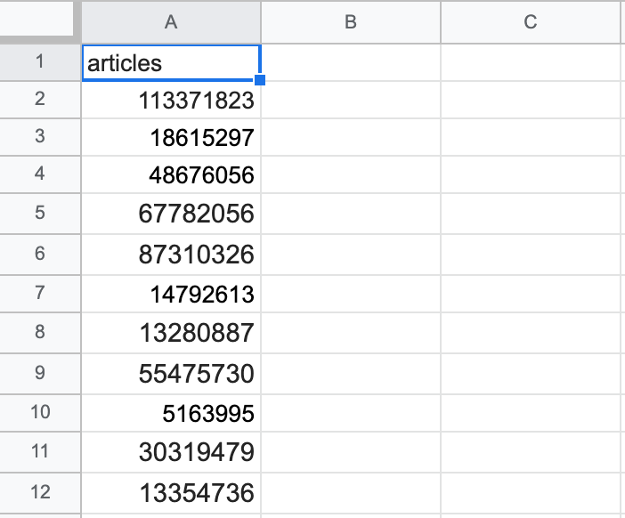

Курилович Назар Иванович 

для запуска task2
с помощью docker-compose:
    1. создать .env файл в директории ./task2
    2. заполнить его согласно примеру (.env.example)
    3. docker-compose up --build

локально:
    1. локально поднять бд postgresql
    2. запустить приложение django python ./apiservice/manage.py runserver
    3. запустить приложение aiohttp python run.py

вид xlsx файла

